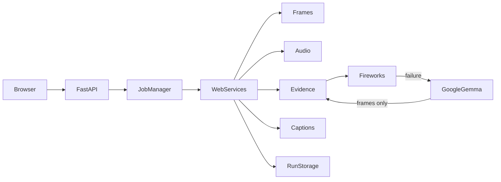

# GemmaClip architecture

GemmaClip has two deliberately separate delivery surfaces. The leaderboard image keeps the existing Python CLI contract: it reads `/input/tasks.json`, processes the requested videos, and progressively writes `/output/results.json`. The web image is a separate multi-stage build that includes FastAPI, ffmpeg, and the compiled React application.



## Web request path

The React/Vite frontend is built into static assets in `Dockerfile.web`. FastAPI serves `/` and client-side routes from `index.html`, serves only the compiled `/assets` directory, and keeps `/api/*` on the API router. Uploaded videos, temporary audio, extracted frames, evidence, captions, and experiment snapshots live under the configured run root and are never served as frontend files.

The API validates requests and delegates work to the framework-independent `WebServices`. `JobManager` serializes mutations per run and owns the small in-memory executor. This is intentionally a single-process demo architecture; a public deployment needs a shared queue and lock before horizontal scaling.

## Shared stages

Both Quick Caption and Gemma Lab use the same stages:

```text
Video metadata -> Frames -> Audio -> Evidence -> Captions -> Compare
```

Quick Caption selects the Balanced preset: six chronological Hybrid frames, four anchors, two high-change frames, automatic bounded audio, automatic routing, and the existing routed temperatures. Gemma Lab exposes the same operations one at a time. Configuration changes invalidate only dependent stages; saved experiments remain immutable.

## Gemma routing and outcomes

The normal visual route uses Gemma 4 26B A4B evidence and Gemma 4 31B caption writing. When a bounded audio candidate is usable and runtime allows, Gemma 4 12B Unified may produce audio-visual evidence. Fireworks is attempted first when configured. A failed Fireworks audio-visual attempt discards audio and uses Google Gemma 4 31B with frames only. Google never receives audio through that fallback. Successful provider fallback remains `model_generated` and is not marked degraded.

Runs distinguish `model_generated`, `evidence_fallback`, and `deterministic_fallback`. Grounded evidence fallback is ready but visibly degraded. Deterministic fallback is an error for the public demo rather than a fabricated successful Gemma result.

The application keeps the 570-second soft runtime guard and existing per-stage/provider deadlines. The leaderboard container retains its 590-second watchdog in the unchanged `Dockerfile`.

## Storage and cleanup

Run IDs are generated server-side and filenames are sanitized. JSON metadata and artifacts are written atomically, subprocesses receive argument arrays, and media commands have bounded timeouts. Temporary audio candidates are removed after analysis/evidence. Inactive pending, ready, and error runs are removed after `GEMMACLIP_WEB_RUN_TTL_SECONDS`; active jobs cannot be deleted.

The production image runs as an unprivileged `gemmaclip` user and expects a persistent `/data/runs` volume. Runtime credentials are supplied through the environment or an env file; they are never build arguments, browser data, run metadata, health output, or lifecycle log fields.

## Observability boundary

Lifecycle logs use a whitelist of safe fields: event, run ID, mode, stage, duration, provider, safe Gemma model label, modality, fallback state, generation outcome, degraded state, status, artifact count, remaining runtime, and sanitized error category. Captions, evidence, prompts, raw provider responses, authorization headers, media bytes, environment values, and private URLs are excluded. Set `GEMMACLIP_LOG_FORMAT=json` for one JSON object per event; readable key/value logs remain the default.
